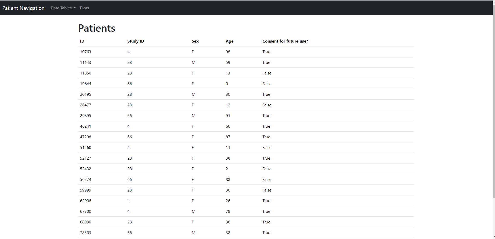
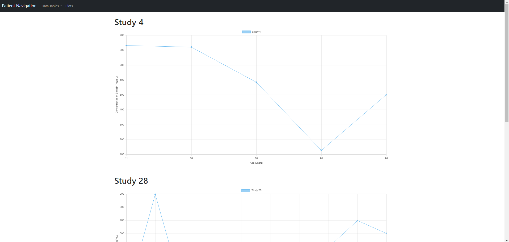

# Zonulin Detection for CMSC 461 (Database Management Systems at UMBC)
The inspiration for this project was that someone I know working at the National Institutes of Health (NIH) were working with fecal and urine samples to determine calprotectin and zonulin levels to measure gut health. After speaking to them about the frustrations of the program they deal with managing their data, I realized that creating something of my own would be something cool to implement. I created a UI with pages consisting of the different SQL tables used and a tab with plots.

The layout of the UI is shown below:

## Technologies used
This project was implemented using Python via Django, with a MySQL database. The frontend consisted of Bootstrap, Chart.js, HTML and CSS. The data used was implemented using the main.py file found in the repository. The database infromation is also included in the sql dump file: `Dump20231228.sql`.